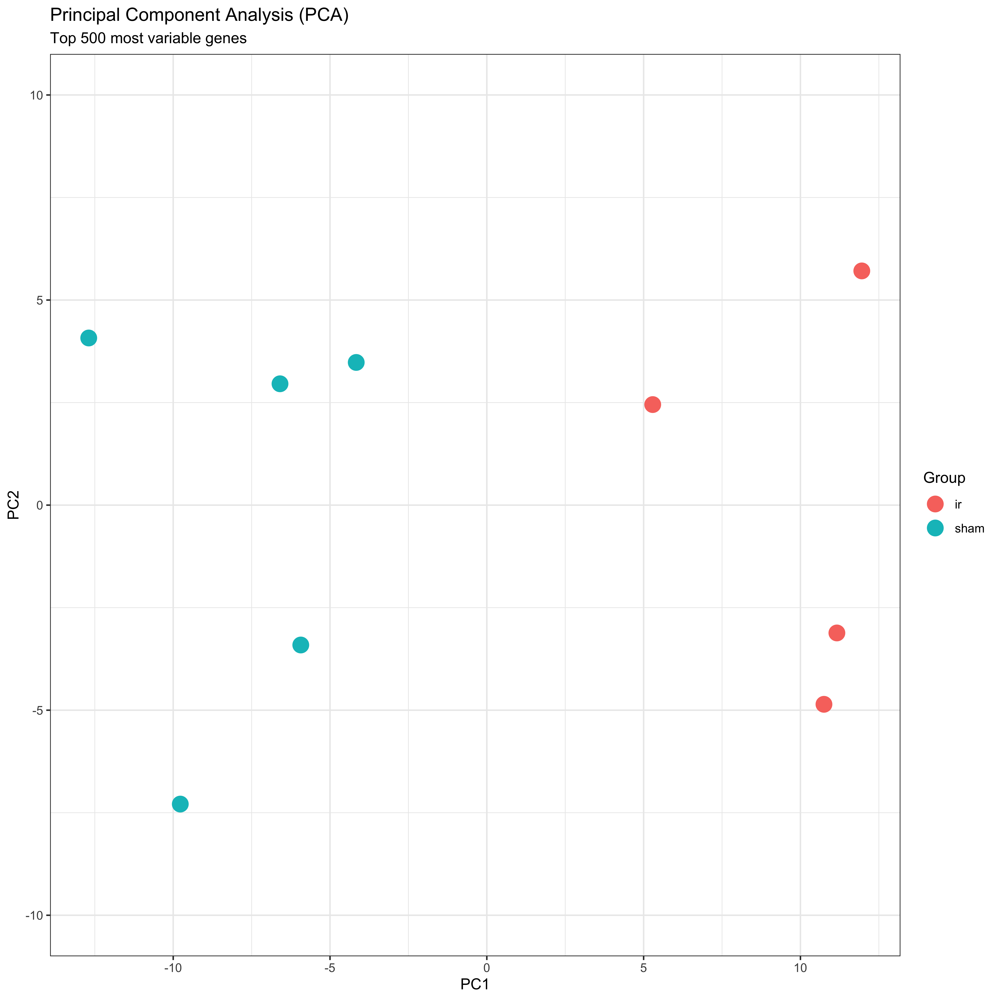
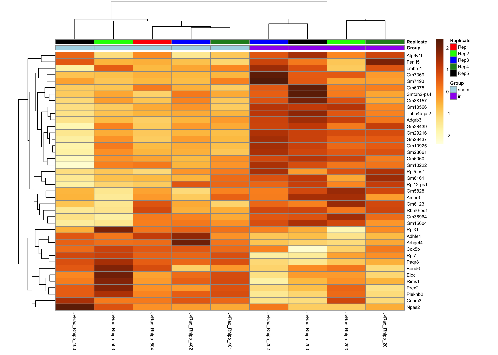
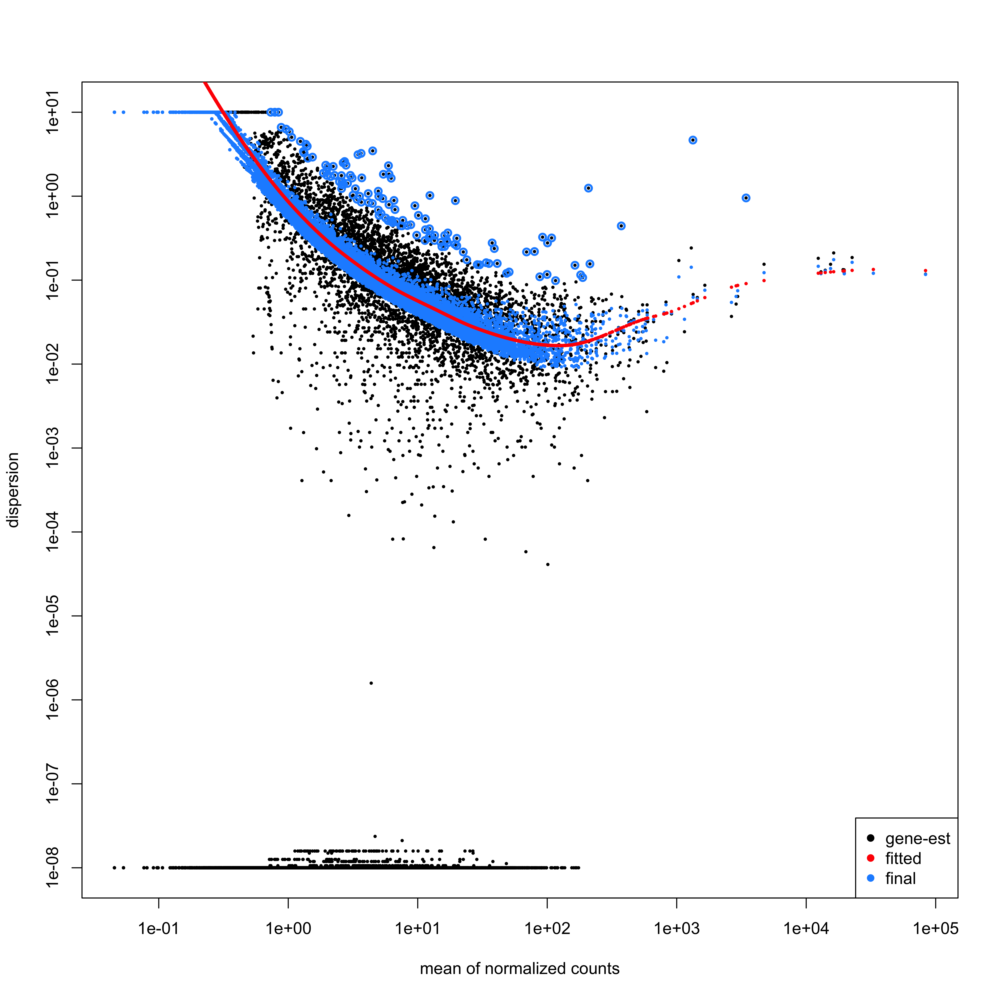
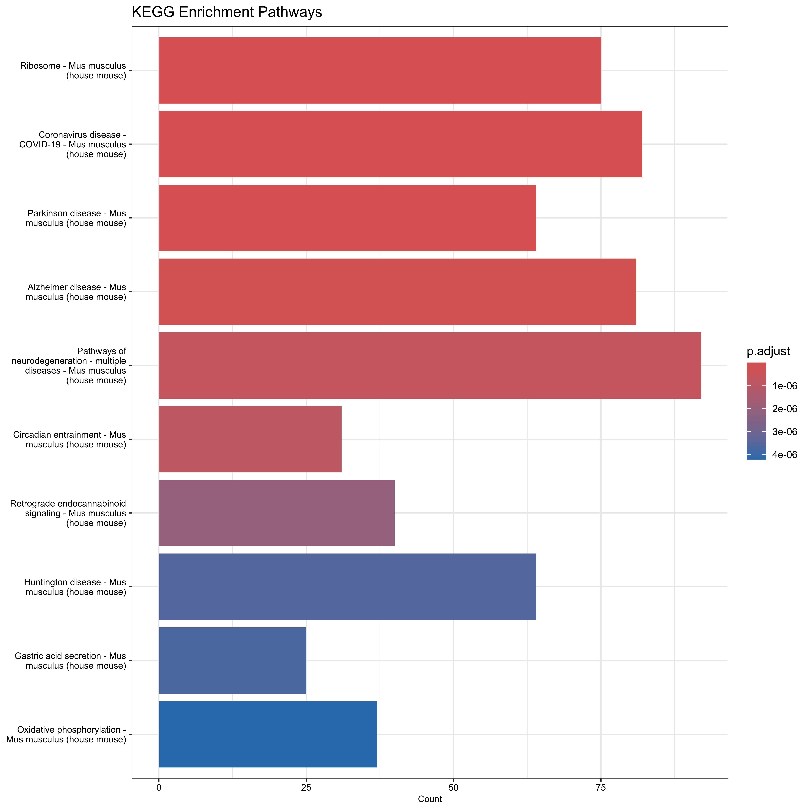
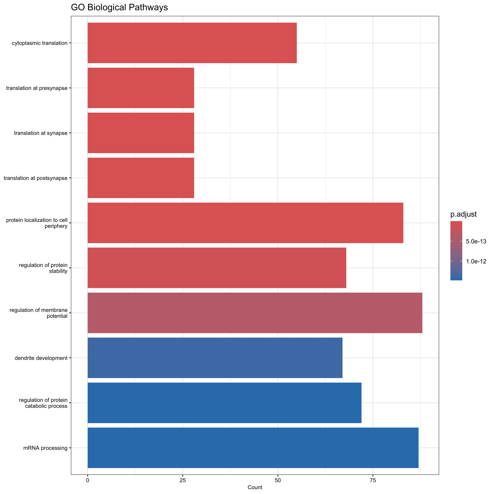
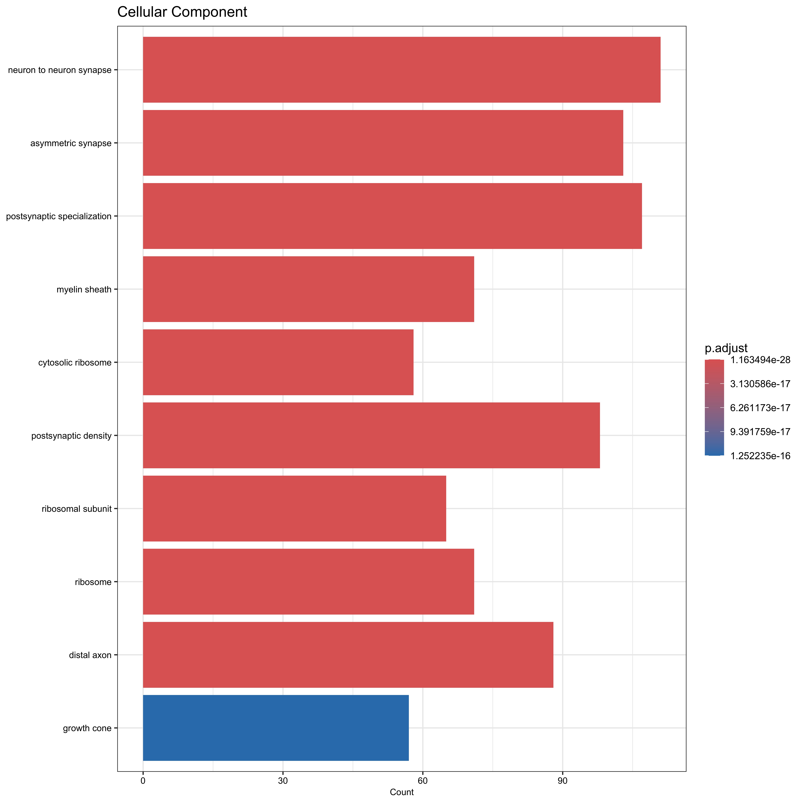
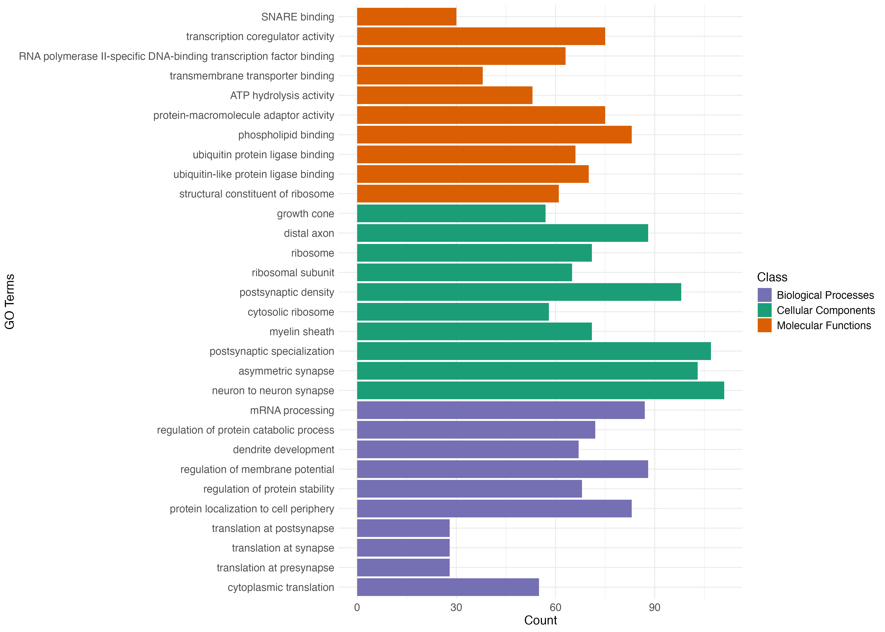

## RNA seq Data Analysis for JvRAD study

This repository contains the pipeline for analyzing the RNA seq data for the JvRAD study.

### File Descriptions

The contents of each subdirectory may vary depending on the specific data integration approach. However, common file types you might encounter include:

* **R Markdown Script ( `.Rmd` )**: This file contains the code for data preprocessing, integration analysis, and visualization.
* **Data Files ( `.csv` or `.txt` )**: These files store the raw omics data, such as RNA-Seq counts, proteomics measurements, and DNA methylation levels.
* **Plots ( `.png` )**: These image files depict the results of the analysis, including heatmaps, network plots etc.

## Files and Descriptions

### JvRad_RNAseq_DEG.Rmd
- **Description**: R Markdown file containing the entire workflow for the JvRAD rnaseq analysis.

## Heatmap

- Displaying PCA plot  using the `PCA_plot` function. ........

## Heatmap

- Displaying the heatmap results using the `Heatmap` function. 

## Volcano

- Displaying the volcano plot for the analysis using the `Volcano` function. 

## plotDisp

- Displaying the plotDisp results using the `plotDisp` function. 
plotDisp

## KEGGPathways

- Displaying the KEGG results using the `pKEGG_Enrichment_Pathways` function. 

## Go Biological Processes

- Displaying the KEGG results using the `GO_Biological_processes` function. 

## GO_molecular_functions

- Displaying the Go analysis results using the `GO_molecular_functions` function. 

## GO_Cellular_Component

- Displaying the Go cellular component analysis results using the `GO_Cellular_Component` function. 

## GO_Terms_Bar_Graph_Grouped

- Displaying the plot of the grouped 3 main GO root ontologies. A custom script was used to generate this plot

## cnet_plot

- Displaying the cnet plot results using the `cnet_plot` function. 

## KEGG_mmu04390

- Displaying the KEGG pathway for the specified processes results using the `KEGG_mmu04390` function. 

### Additional Notes

* This repository is a work in progress, and the contents may be updated as the analysis evolves.
* Refer to the R Markdown script in each subdirectory for more details about the specific data integration approach used.
* If you have any questions or require further assistance, please refer to the relevant documentation for MixOmics or contact the repository owner.
