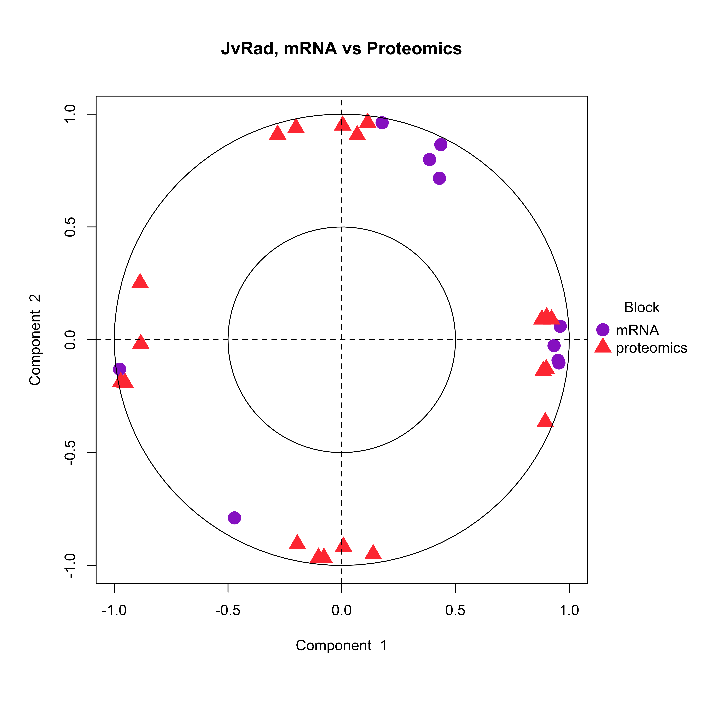
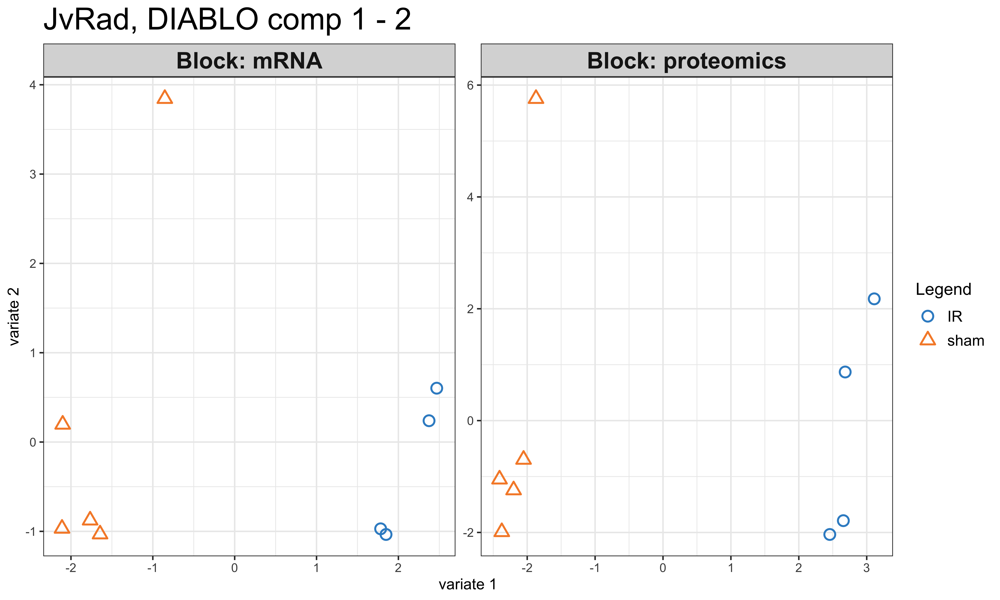
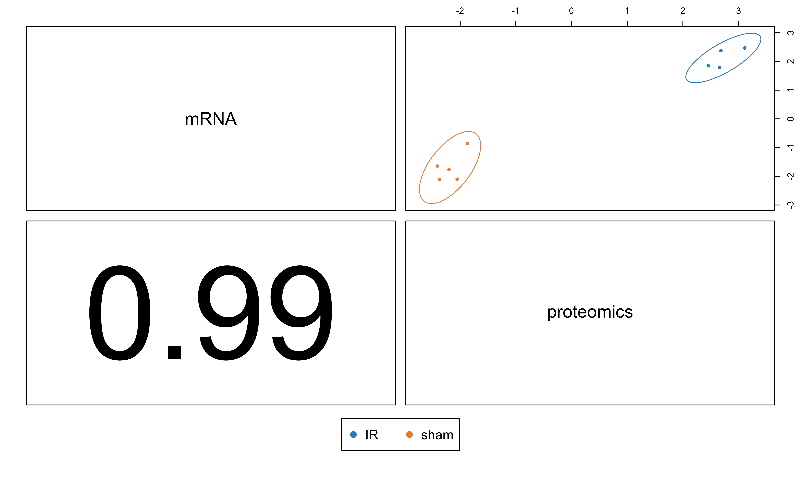
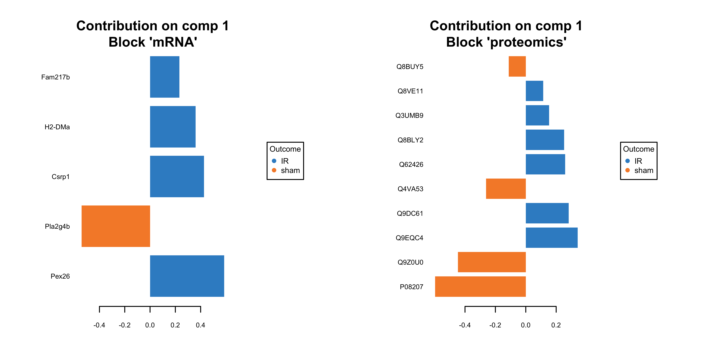

# JvRAD mRNA and Proteomics Data Integration with MixOmics (Diablo)

## **Introduction**
- This repository contains the R Markdown script (JvRad_RNAseqProteomics_Integration.Rmd) and associated data files for the JvRAD project and integrating mRNA (RNA-Seq) and proteomics data from the JvRad project using MixOmics.
- The analysis workflow is implemented in R using the Diablo toolkit from the MixOmics package.
- The analysis workflow aims to identify potential co-regulations and correlations between mRNA and protein expression patterns.
  
## **Data Integration Pipeline**
The script performs the following steps:

1. **Data Preprocessing**: Reads and preprocesses both RNA-Seq count data and proteomics data to ensure compatibility for integration.
Data Binding: Binds the preprocessed RNA-Seq and proteomics data into a single combined data matrix.

2. **Missing Value Imputation**: Handles missing values in both datasets (if any) using appropriate methods.
DIABLO Analysis: Performs Data Integration Analysis for Biomarker discovery with Latent variabel Optimization (DIABLO) using the MixOmics package. This step involves:

3. **Pairwise PLS Comparisons**: Examining the correlation between top features from each data set.
Model Selection: Determining the optimal number of components and variables to retain for the model based on performance metrics.

4. **Final Model**: Fitting a final DIABLO model with the chosen parameters to identify relevant features and relationships between the datasets.

5. **Visualization**: Generates informative plots to visualize the results, including Circos Plot, Network Plot, Loadings Plot and  Heatmap.

By integrating RNA-Seq and proteomics data, this analysis aims to provide a more comprehensive understanding of the underlying biological processes in the JvRad project.

## Input Files and Descriptions

### JvRad_RNAseqProteomics_Integration.Rmd
- **Description**: The two main input files expected by the R Markdown script (`JvRad_RNAseqProteomics_Integration.Rmd`) are:

1. **RNA-Seq Count Data**: This file should be a table containing gene identifiers (e.g., gene symbols or Ensembl IDs) as rows and samples as columns. Each entry in the table represents the number of reads (counts) mapped to a particular gene in a specific sample. The file format is expected to be comma-separated values (CSV) or tab-delimited (TXT) with a header row.

2. **Proteomics Data**: This file should be a table containing protein identifiers and their corresponding expression values (e.g., intensity, abundance) across samples. Similar to the RNA-Seq data, the file should have a header row with protein identifiers in rows and samples in columns. The format can be CSV or TXT.

Both files need to be preprocessed within the script to ensure compatibility for integration. This may involve handling missing values, normalization (if necessary), and potentially removing uninformative features. 

## Visualization
## VarPlot 

- Var plot showing the correlation between the features. 

## PlotInd

- PlotInd Plots for mRNA and Proteomics 

## CircosPlot 

- Circular plot visualizing the relationships between mRNA and protein data, aiding in the exploration of potential co-regulations or correlations.

## PlotDiablo

- Plot Diablo plot

### jvrad_cim_heatmap.png
## CIM Heatmap

- Heatmap depicting the integrated data matrix, potentially showcasing relationships between mRNA and protein expression patterns across samples.

## Network Plot

- Network plot depicting the interactions between mRNA and protein features, providing a visual representation of the integrated data structure.

## Plot Loadings

- Plot visualizing the loadings from a principal components analysis (PCA) or other exploratory technique, potentially highlighting factors driving variation in the integrated mRNA-proteomics data.
