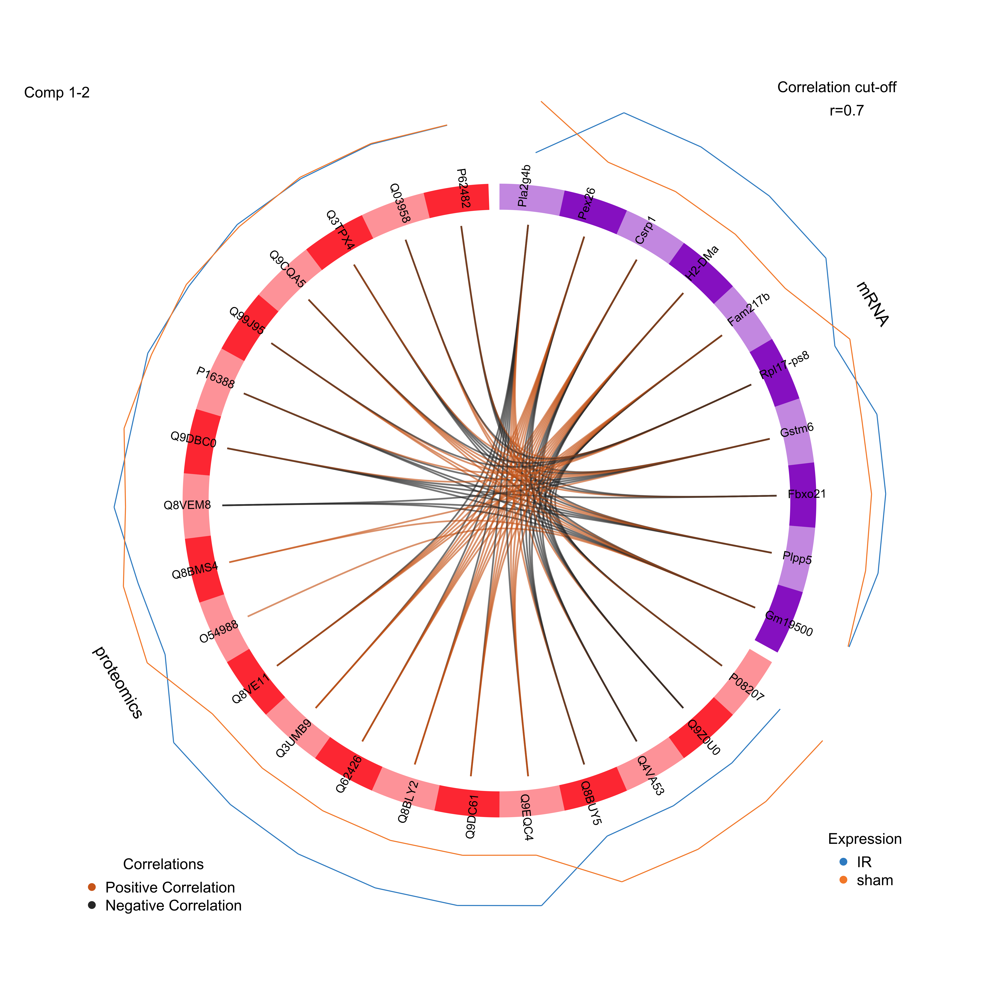
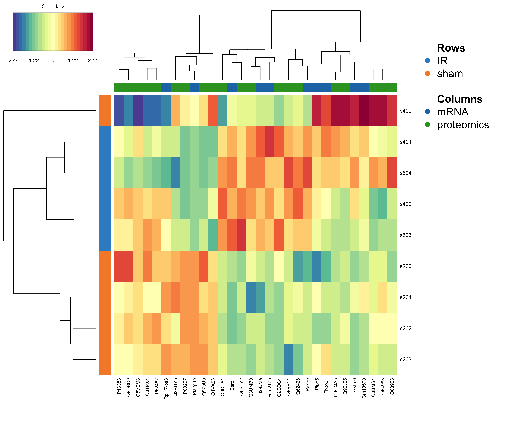
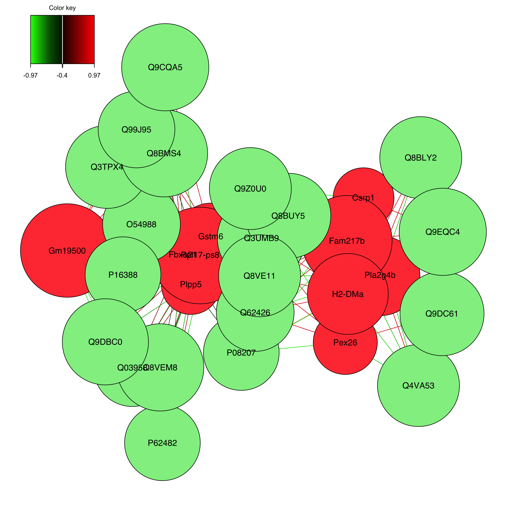

# JvRAD mRNA and Proteomics Data Integration with MixOmics

## **Introduction**
- This repository contains the R Markdown script (JvRad_RNAseqProteomics_Integration.Rmd) and associated data files for the JvRAD project and integrating mRNA (RNA-Seq) and proteomics data from the JvRad project using MixOmics.
- The analysis workflow aims to identify potential co-regulations and correlations between mRNA and protein expression patterns.
- The analysis workflow is implemented in R using the Diablo toolkit from the MixOmics package.
## **Data Integration Pipeline**
The script performs the following steps:

+ **Data Preprocessing**: Reads and preprocesses both RNA-Seq count data and proteomics data to ensure compatibility for integration.
Data Binding: Binds the preprocessed RNA-Seq and proteomics data into a single combined data matrix.

+ **Missing Value Imputation**: Handles missing values in both datasets (if any) using appropriate methods.
DIABLO Analysis: Performs Data Integration Analysis for Biomarker discovery with Latent variabel Optimization (DIABLO) using the MixOmics package. This step involves:

+ **Pairwise PLS Comparisons**: Examining the correlation between top features from each data set.
Model Selection: Determining the optimal number of components and variables to retain for the model based on performance metrics.

+ **Final Model**: Fitting a final DIABLO model with the chosen parameters to identify relevant features and relationships between the datasets.

+ **Visualization**: Generates informative plots to visualize the results, including Circos Plot, Network Plot, Loadings Plot and  Heatmap.

By integrating RNA-Seq and proteomics data, this analysis aims to provide a more comprehensive understanding of the underlying biological processes in the JvRad project.

## Files and Descriptions

### JvRad_RNAseqProteomics_Integration.Rmd
- **Description**: R Markdown file containing the entire workflow for the JvRAD proteomics analysis.

## CircosPlot 

- Circular plot visualizing the relationships between mRNA and protein data, aiding in the exploration of potential co-regulations or correlations.

### jvrad_cim_heatmap.png
## CIM Heatmap

- Heatmap depicting the integrated data matrix, potentially showcasing relationships between mRNA and protein expression patterns across samples.

## Network Plot

- Network plot depicting the interactions between mRNA and protein features, providing a visual representation of the integrated data structure.

## Plot Loadings

- Plot visualizing the loadings from a principal components analysis (PCA) or other exploratory technique, potentially highlighting factors driving variation in the integrated mRNA-proteomics data.
