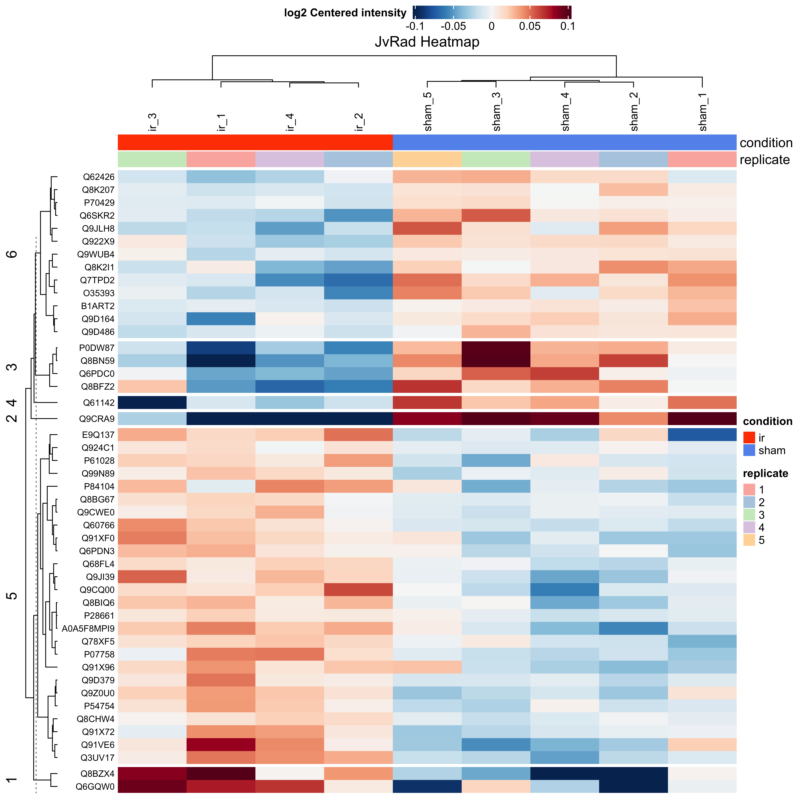
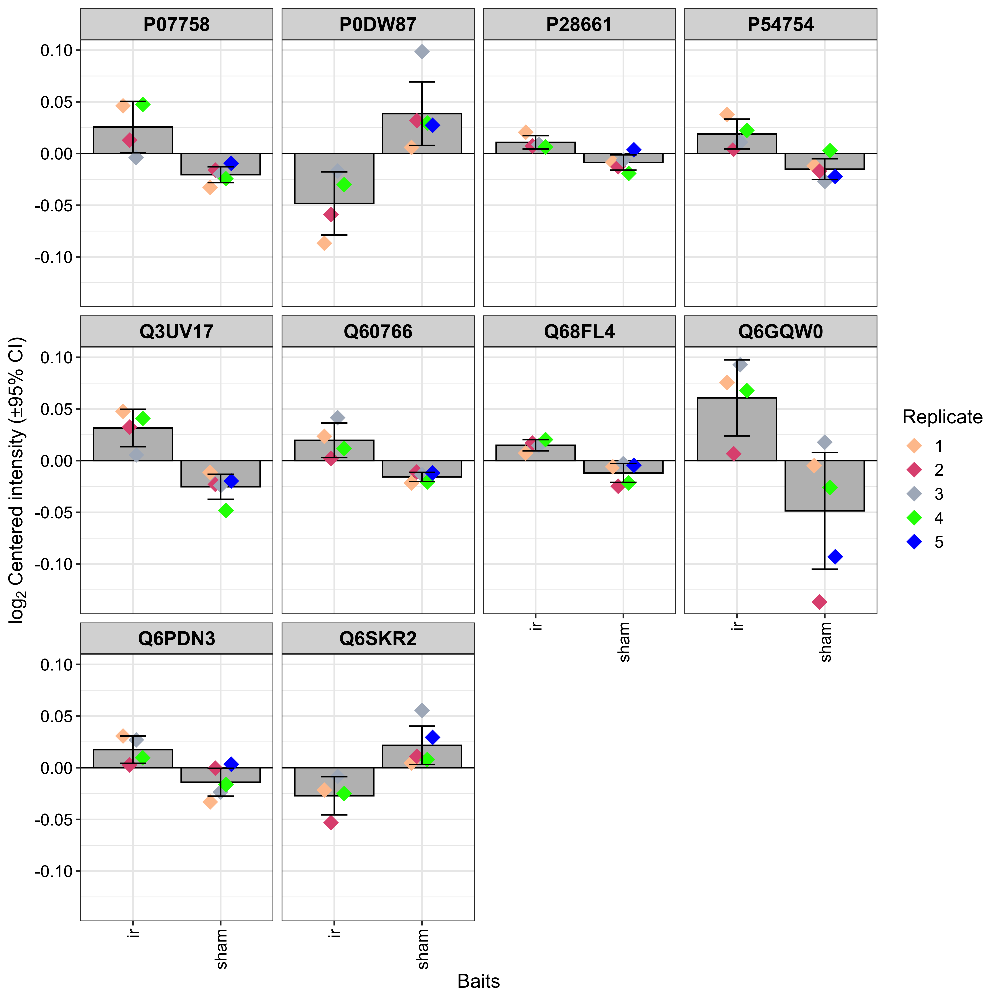
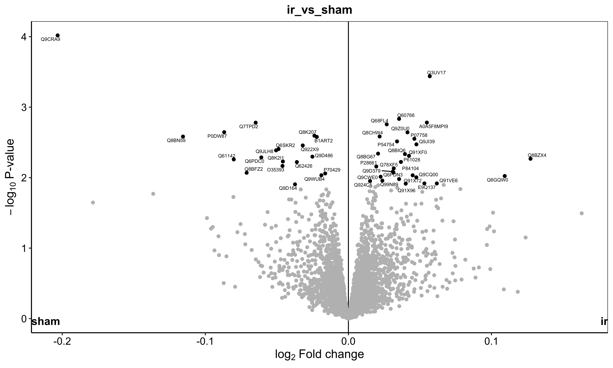

# JvRAD Proteomics Analysis

- This repository contains scripts and data for the JvRAD project, focused on proteomics analysis. The analysis workflow is implemented in R using various packages including DEP, dplyr, and SummarizedExperiment.

## Files and Descriptions

### JvRAD.Rmd
- **Description**: R Markdown file containing the entire workflow for the JvRAD proteomics analysis.

## EnrichMKEGG Plot

- Displaying KEGG pathway enrichment analysis results using the `enrichMKEGG` function. This plot shows the enriched KEGG pathways and their associated statistics, helping to identify pathways that are significantly enriched among differentially expressed proteins.

### jvrad_cnetplot.png
## CNet Plot

- Displaying network plots for enriched KEGG pathways using the `cnetplot` function. These plots provide a visual representation of the relationships between proteins within enriched pathways, aiding in the interpretation of pathway-level effects.

### jvrad_heatmap.png

## Heatmap

## KEGG Enrichment Pathways

## Key Proteins Single Plots

## Volcano Plot

## JvRAD Plot

## JvRAD R Markdown File
[JvRAD.Rmd](JvRAD.Rmd)

## Pathview Plot

## Pathview Image

## Pathview XML File
[Pathview XML File](mmu05014.xml)
