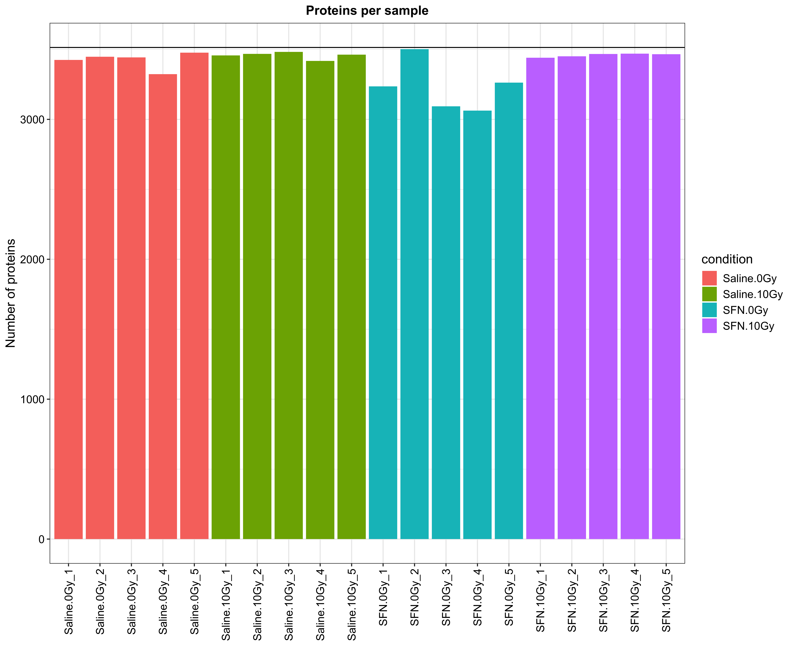
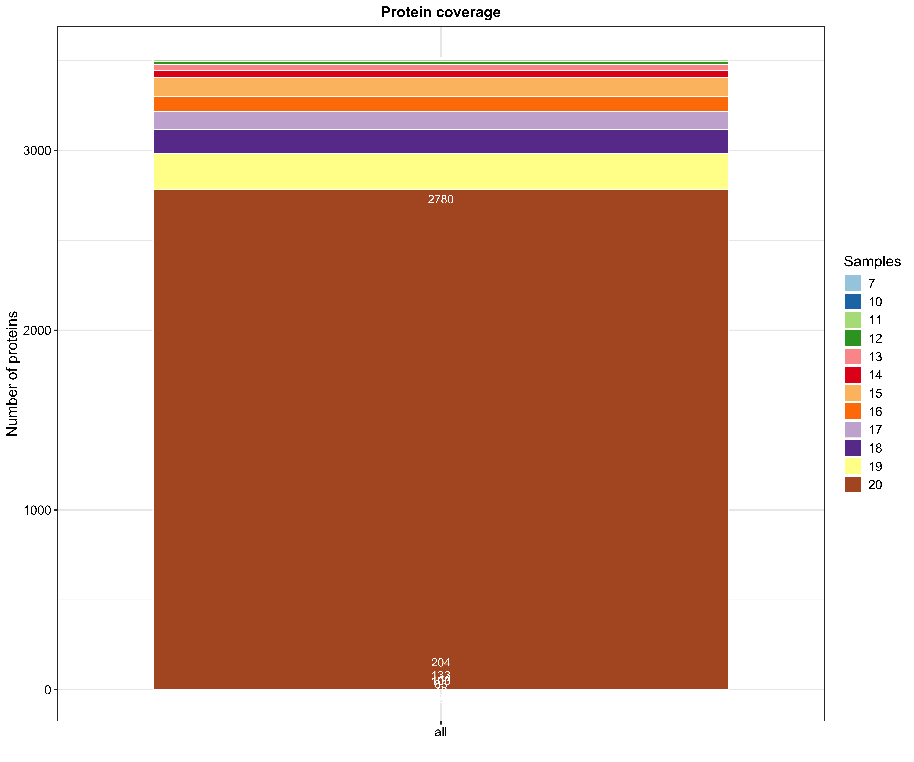
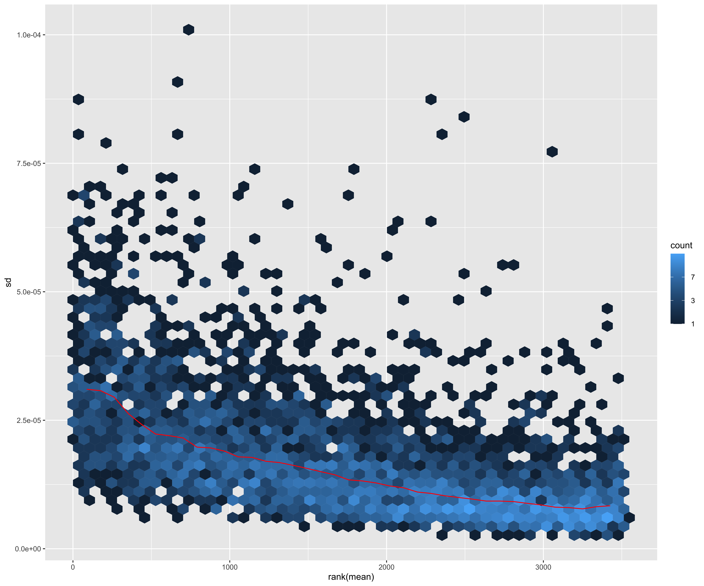
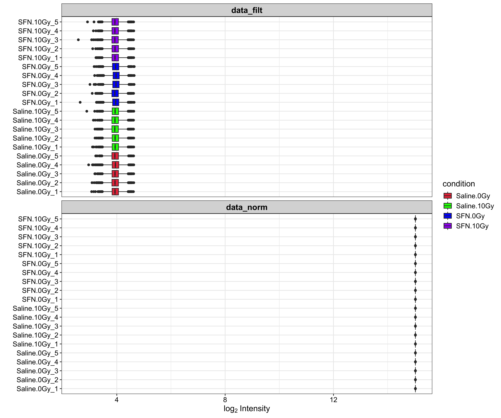

# RNA-Seq Proteomics Analysis Workflow

- This repository contains scripts for analyzing RNA-seq proteomics data using the DEP package in R. The workflow includes data import, normalization, differential expression analysis, and pathway enrichment analysis.

## Requirements

- R (tested on version 4.1.0)

## Installation

- Before running the code, make sure to install the required R packages. You can install them using the following commands:

- For the main proteomics analysis
```R
if (!requireNamespace("BiocManager", quietly = TRUE))
    install.packages("BiocManager")

BiocManager::install(c("DEP", "dplyr", "proteus", "SummarizedExperiment"))

```

- For the proteomics network/pathway analysis
```R
# Install BiocManager if not already installed
if (!requireNamespace("BiocManager", quietly = TRUE))
    install.packages("BiocManager")

# Use BiocManager to install Bioconductor packages
BiocManager::install("pathview")
BiocManager::install("enrichplot")
BiocManager::install("DOSE")

```


# Workflow Overview

## Data Import and Cleaning:

- Reads data from a CSV file (combined_results.csv) containing protein information and expression values.
- Cleans column names and extracts unique protein IDs.

## Data Wrangling and Experimental Design:

- Creates a data frame (experimental_design) containing sample labels, conditions, and replicates.
- Defines expression columns based on sample names.

## Data Exploration:

- Generates a mean-standard deviation plot (meanSdPlot) to visualize data distribution across samples.
- Analyzes the number of proteins quantified in each sample with plot_frequency before and after filtering missing values (filter_missval).
- Explores protein coverage across samples with plot_coverage.
- Creates histograms to visualize the distribution of expression values.

## Normalization:

- Applies VSN normalization (normalize_vsn) for variance stabilization.
- Optional: Includes code for median (normalize_median) and quantile normalization (normalizeQuantiles) but these are not applied by default.

## Comparison of Raw and Normalized Data:

- Generates a plot (plot_normalization) to compare the distribution of expression values before and after normalization.

## Missing Value Imputation:

- Analyzes missing values with plot_missval and identifies undetected proteins with plot_detect.
- Imputes missing values using the minimum probability method (impute).

## Visualization and Quality Control:

- Compares the distribution of expression intensities before and after imputation with plot_imputation.
- Performs Principal Component Analysis (PCA) with plot_pca to visualize sample clustering based on protein expression.

## Differential Enrichment Analysis:

- Conducts differential analysis (test_diff) using linear models and empirical Bayes statistics.
- Identifies significantly differentially expressed (DE) proteins based on a fold change threshold and adjusted p-value (add_rejections).

## Visualization of DE Proteins:

- Generates a volcano plot (plot_volcano) to visualize fold changes and significance of DE proteins for a specific contrast.
- Creates individual plots for selected proteins with plot_single.

## Correlation Analysis:

- Calculates protein-protein correlations (plot_cor) and generates a heatmap with pheatmap for visualization.

## Heatmap of Expression Data:

- Creates a heatmap with hierarchical clustering (plot_heatmap) to visualize protein expression patterns across samples and replicates.
- Allows customization of clustering methods, color limits, and display options.

## Comparison Heatmap:

- Generates a heatmap (plot_heatmap) specifically focused on comparing expression across different conditions.

## Volcano Plot with Color for Up/Down Regulation:

- Demonstrates how to modify the volcano plot code (plot_volcano) to color data points based on their fold change (up-regulated in red, down-regulated in blue).

## Visualization of Differentially Abundant Proteins:

- Creates line plots (plot_single) to visualize the expression profiles of specific DE proteins across conditions and replicates.

## Pathway Enrichment Analysis:

- Extracts information about significantly DE proteins (get_results).
- Performs KEGG pathway enrichment analysis with enrichKEGG and visualizes enriched pathways using barplots (barplot) and network plots (cnetplot).
- Optionally performs additional enrichment analysis methods like MKEGG (enrichMKEGG) and visualizes the

## Visualization

## 1. **Plot Protein Numbers**


- Barplot of the number of identified proteins per sample.

## 2. **Protein Coverage**


- Barplot of the protein coverage in all samples.

## 3. **Mds Plot**


- Mds plot.

## 3. **Normalization (Raw vs Normalized)**


- Normalization plot.